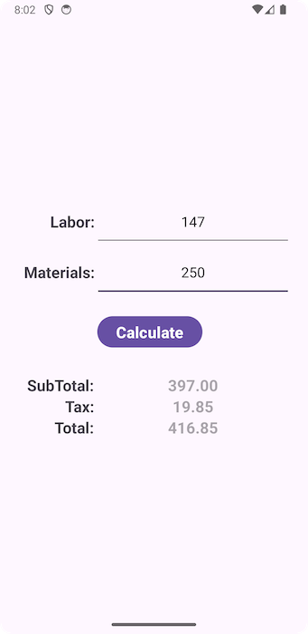

# VS-Contractor-Calculator

## Description

Contractor Calculator is a simple Android app that calculates the subTotal, Tax, and Total value based on the user input values on Labor and Materials. The application considers 5% as a constant value for Tax. The subTotal value is the summation of Labor and Materials input values; the Tax value is 5%, and the Total value is the sum of the subtotal and Tax fields. The app was developed on Android Studio in Java and Kotlin to generate Gradle scripts.

## Screenshots

 

## License

  

